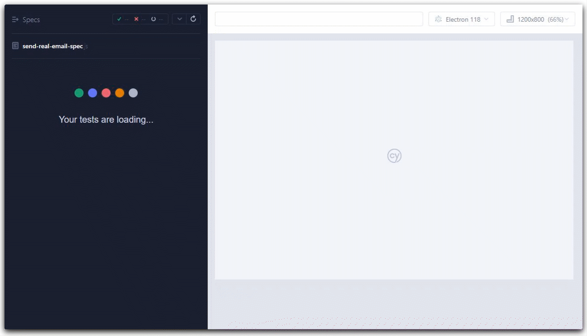

# cypress-email-example

Sending emails using [nodemailer](https://nodemailer.com/about/), receive the using [smtp-tester](https://github.com/deitch/smtp-tester) or [Mailinator](https://www.mailinator.com/) and testing the received email using [Cypress](https://github.com/cypress-io/cypress).
The Realmail branch uses Mailinator API to check the inbox and get the confirmation code, while the Dev branch uses a local receiver.


### Before you begin, create a .env file in the root directory:
_You should replace this with real email data and sign up for a Mailinator account to obtain the API token._

```
MAIL_SENDER_ADDRESS='your@mailtest.com'
MAIL_SENDER_PASSWORD='testpassword'
MAIL_SMTP_HOST='smtp.hostinger.com'
MAIL_SMTP_PORT=465
MAILINATOR_API_URL='https://api.mailinator.com/api/v2/domains/private'
MAILINATOR_API_TOKEN='YourMailinatorTokenHere'
MAIL_RECEIVER_ADDRESS='receiver@teamaaaaaa.testinator.com'
```

## Install 
```shell
$ npm install
```

## Cypress open
```shell
$ npm start
# from another terminal:
$ npx cypress open
# click the send-real-email-spec.js
```

## Headless mode
```shell
$ npm run test
```

## The application

The application shows the registration page [pages/index.js](./pages/index.js) where the user can fill the email and click the submit button. The page makes an Ajax request to the [pages/api/register.js](./pages/api/register.js) handler which sends an email. The email has the confirmation code the user is expected to enter on the confirmation page [pages/confirm.js](./pages/confirm.js).

## Email server

The emails are sent using [nodemailer](https://nodemailer.com/about/), see [emailer.js](./emailer.js). During tests the SMTP server is running inside [cypress/plugins/index.js](./cypress/plugins/index.js) process.

[ci image]: https://github.com/bahmutov/cypress-email-example/workflows/ci/badge.svg?branch=main
[ci url]: https://github.com/bahmutov/cypress-email-example/actions
[badges image]: https://github.com/bahmutov/cypress-email-example/workflows/badges/badge.svg?branch=main
[badges url]: https://github.com/bahmutov/cypress-email-example/actions
[renovate-badge]: https://img.shields.io/badge/renovate-app-blue.svg
[renovate-app]: https://renovateapp.com/